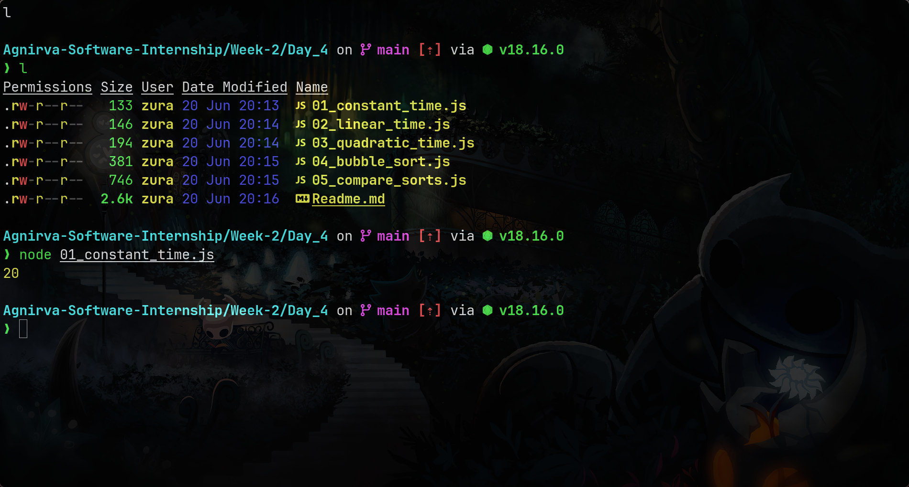
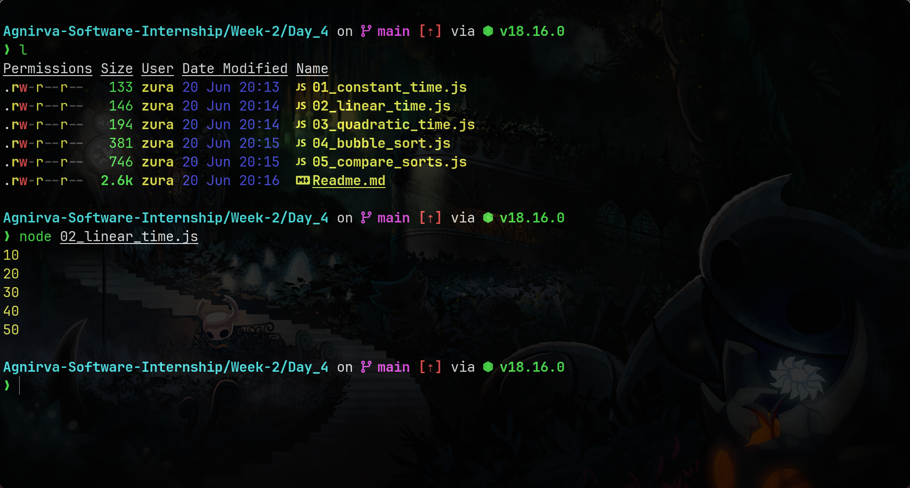
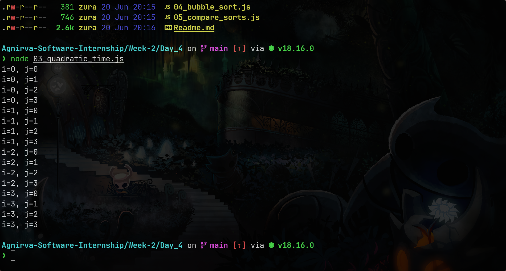
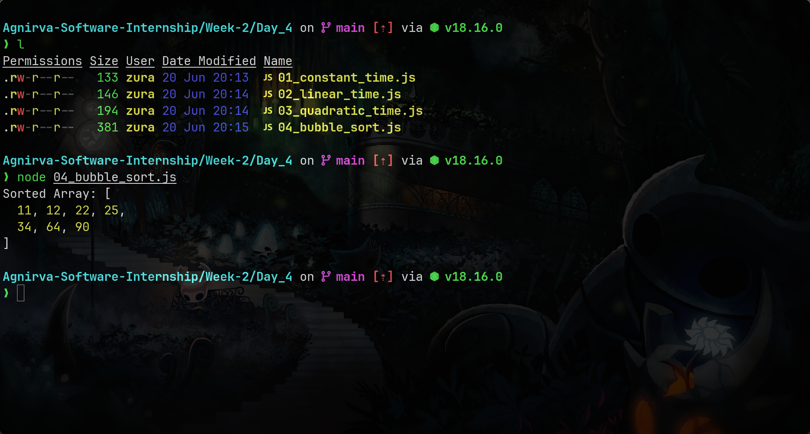
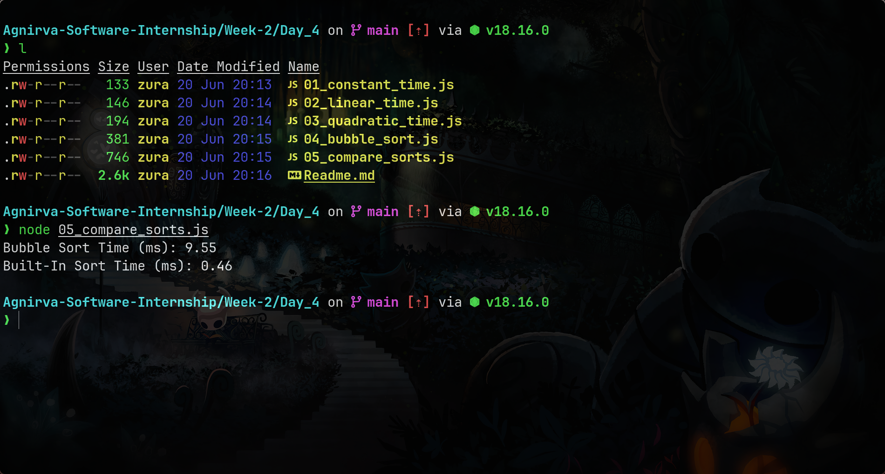

# Week 2 Day 4: Big-O Notation

## Objectives

- Understand algorithm complexity.
- Learn to analyze code using Big-O Notation.
- Implement and analyze Bubble Sort.
- Compare Bubble Sort to JavaScript’s built-in `.sort()`.

---

## 📚 Big-O Concepts

| Big-O    | Description      | JavaScript Example      |
| -------- | ---------------- | ----------------------- |
| O(1)     | Constant time    | Accessing array element |
| O(n)     | Linear time      | Looping through array   |
| O(n²)    | Quadratic time   | Nested loops            |
| O(log n) | Logarithmic time | Binary Search           |
| O(2ⁿ)    | Exponential time | Recursive Fibonacci     |

---

## ✅ Code Examples

### `01_constant_time.js`

Accesses an array index — takes the same time regardless of size.

**Screenshot:**

---

### `02_linear_time.js`

Uses `forEach()` to loop through an array — time grows with input size.

**Screenshot:**

---

### `03_quadratic_time.js`

Nested `for` loops — time grows exponentially with input size.

**Screenshot:**

---

## 🔍 Bubble Sort

### `04_bubble_sort.js`

- Basic implementation of Bubble Sort.
- Time Complexity: O(n²)
- Inefficient for large lists.

**Output Screenshot:**

---

## 🧪 Performance Comparison

### `05_compare_sorts.js`

- Generates random array of size 1000
- Times:
  - `bubbleSort()` — O(n²)
  - `Array.prototype.sort()` — O(n log n)

**Performance Screenshot:**

---

## 📁 Folder Contents

| File Name            | Description                               |
| -------------------- | ----------------------------------------- |
| 01_constant_time.js  | O(1) example                              |
| 02_linear_time.js    | O(n) example                              |
| 03_quadratic_time.js | O(n²) example                             |
| 04_bubble_sort.js    | Bubble Sort implementation                |
| 05_compare_sorts.js  | Compare performance of bubble vs built-in |
| assets/              | Contains screenshots of output            |

---

## ✅ Summary

- Big-O describes how code behaves as data grows.
- Avoid inefficient patterns like O(n²) in real-world web apps.
- Use built-in methods when performance matters — they’re optimized!

---

## 🚀 Coming Up Next

**Day 5: Mini Project – Number Guessing Game 🎮**

You'll build an interactive browser-based game using loops, conditionals, and logic.
