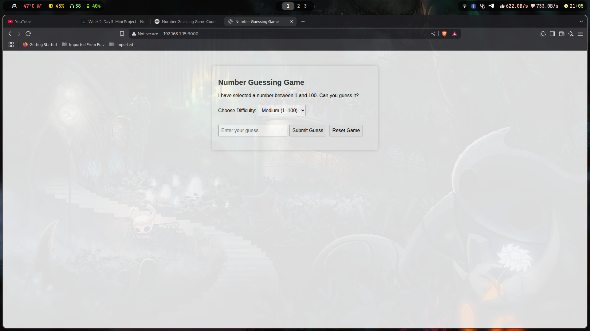
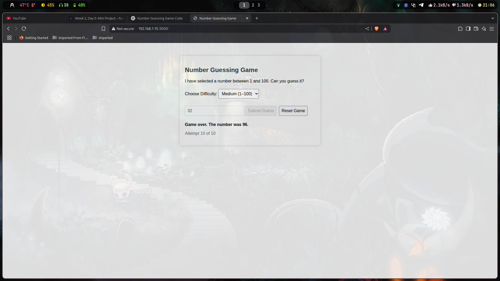

# 🎯 Number Guessing Game

A browser-based interactive number guessing game built with **HTML**, **CSS**, and **JavaScript**.

Test your luck and logic by guessing a randomly generated number, with selectable difficulty levels and limited attempts.

---

## 📸 Screenshots

Here’s a preview of the game in action:

| Start Screen                                  | Too High Feedback                             | Winning State                                 |
| --------------------------------------------- | --------------------------------------------- | --------------------------------------------- |
|  |  |  |

---

## 📌 Features

- ✅ Random number generation
- ✅ Easy, Medium, and Hard difficulty levels
- ✅ Input validation and real-time feedback
- ✅ Maximum 10 attempts per game
- ✅ Option to reset the game anytime
- ✅ Responsive and interactive browser experience

---

---

## 🧠 How It Works

- The game picks a secret number between 1 and `N` (based on difficulty).
- You enter your guess in the input field.
- Feedback is shown:
  - Too High
  - Too Low
  - Correct (with number of attempts)
- You get up to 10 guesses. After that, the game ends.
- You can reset the game or change the difficulty anytime.

---

## 📂 Project Structure

```
.
├── assets
│   ├── 250622_21h05m33s_screenshot.png
│   ├── 250622_21h05m46s_screenshot.png
│   └── 250622_21h06m28s_screenshot.png
├── index.html        # Main game UI
├── script.js         # Game logic and interactivity
└── style.css         # Styling
```

---

## 🚀 Run Locally

```bash
git clone https://github.com/vinayydv3695/number-guessing-game.git
cd number-guessing-game
npx serve
```

Then visit:

```
http://localhost:3000
```

---

## 🌐 Deploy to GitHub Pages

1. Push your code to a GitHub repository
2. Go to **Settings > Pages**
3. Select `main` branch and `/(root)` folder
4. GitHub will generate a live URL like:
   ```
   https://vinayydv3695.github.io/number-guessing-game
   ```

---
