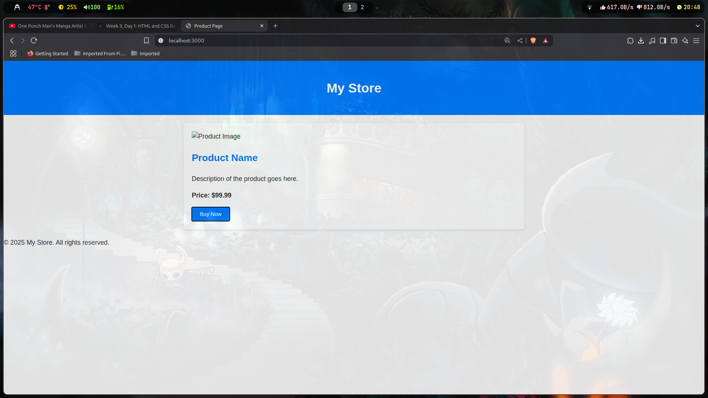

# 🛍️ Product Page – HTML & CSS Project

A simple, clean product page built using **HTML** and **CSS**. This is part of **Week 3, Day 1** of the Web Development Basics module.

---

## 📸 Screenshot

| Product Page Preview                          |
| --------------------------------------------- |
|  |

---

## 🧾 Features

- 🧱 Structured using semantic HTML
- 🎨 Styled with responsive and modern CSS
- 🖼️ Includes a product image and description
- 💰 Price and call-to-action "Buy Now" button
- 📱 Mobile-friendly layout using Flexbox

---

## 📂 Project Structure

```
.
├── assets
│   └── 250625_20h48m22s_screenshot.png  # Screenshot of the product page
├── index.html                           # Main HTML file
└── styles.css                           # External CSS styles
```

---

## 🌐 How to Use

1. Clone this repository:

   ```bash
   git clone https://github.com/your-username/product-page.git
   cd product-page
   ```

2. Open `index.html` in any modern browser:
   ```bash
   firefox index.html
   # or
   google-chrome index.html
   ```

## 🛠️ Tech Stack

- HTML5
- CSS3 (Flexbox, Box model, Responsive Design)

---
