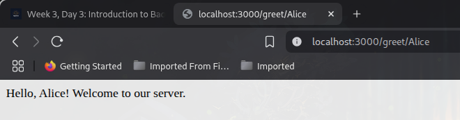
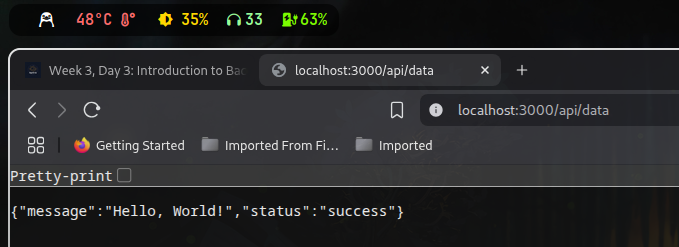

# Node.js Back-End Server (Day 3)

This project is a simple Node.js + Express back-end server built as part of Day 3 in the Web Development curriculum. It demonstrates basic back-end functionality including routing, dynamic parameters, and JSON responses.

## Features

- Basic Express server setup
- Dynamic route: `/greet/:name`
- JSON API route: `/api/data`
- Runs on `localhost:3000`

## Getting Started

### Prerequisites

- [Node.js](https://nodejs.org/) installed

Then visit the following in your browser:

- http://localhost:3000/ — Root route
- http://localhost:3000/greet/Alice — Dynamic greeting
- http://localhost:3000/api/data — JSON API response

## File Structure

```
.
├── assets
│   ├── 250704_19h59m51s_screenshot.png
│   └── 250704_20h00m09s_screenshot.png
└── node-server
    ├── node_modules
    ├── package-lock.json
    ├── package.json
    └── server.js
```

## Screenshots

### Root Route



### JSON API Route


