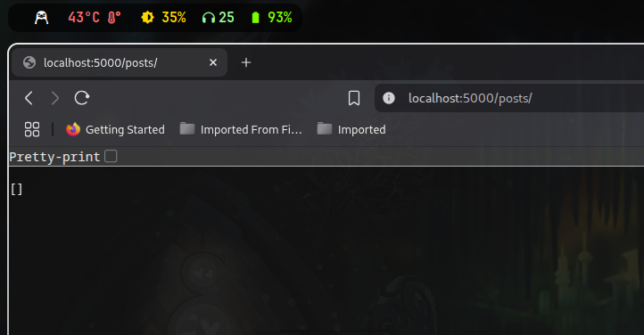

# Blog App

A simple full-stack Blog Application built using **Node.js (Express)** for the backend and **HTML, CSS, JavaScript** for the frontend.

---

## Features

- Create new blog posts
- View all blog posts
- Delete blog posts
- In-memory data storage (no DB needed)
- RESTful API design

---

## Project Structure

```
blog-app/
├── assets/                         # Screenshots or assets
│   ├── 250711_09h46m48s_screenshot.png   # Creating a post
│   ├── 250711_09h51m09s_screenshot.png   # Viewing posts
│   ├── 250711_09h55m56s_screenshot.png   # CLI terminal showing curl commands
│   └── 250711_09h56m20s_screenshot.png   # Deleting a post
├── index.html                      # Frontend HTML
├── styles.css                      # Styling for the app
├── script.js                       # Frontend logic (fetch API, DOM updates)
├── server.js                       # Express backend server
├── package.json                    # Node.js project file
└── package-lock.json               # Dependency lock file
```

---

## Screenshots

### Create Post


### View Posts


### Terminal with CLI commands


### Delete Post



---

## API Endpoints

| Method | Endpoint     | Description       |
| ------ | ------------ | ----------------- |
| GET    | `/posts`     | Get all posts     |
| POST   | `/posts`     | Create a new post |
| DELETE | `/posts/:id` | Delete a post     |

---
