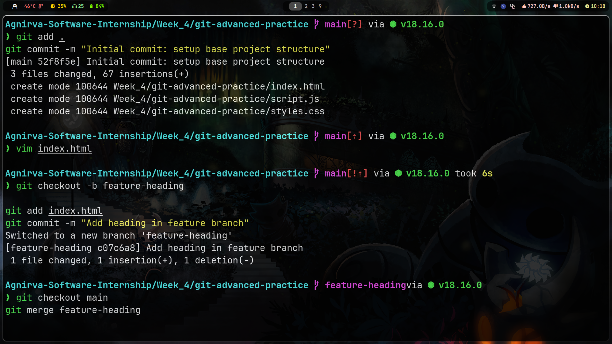
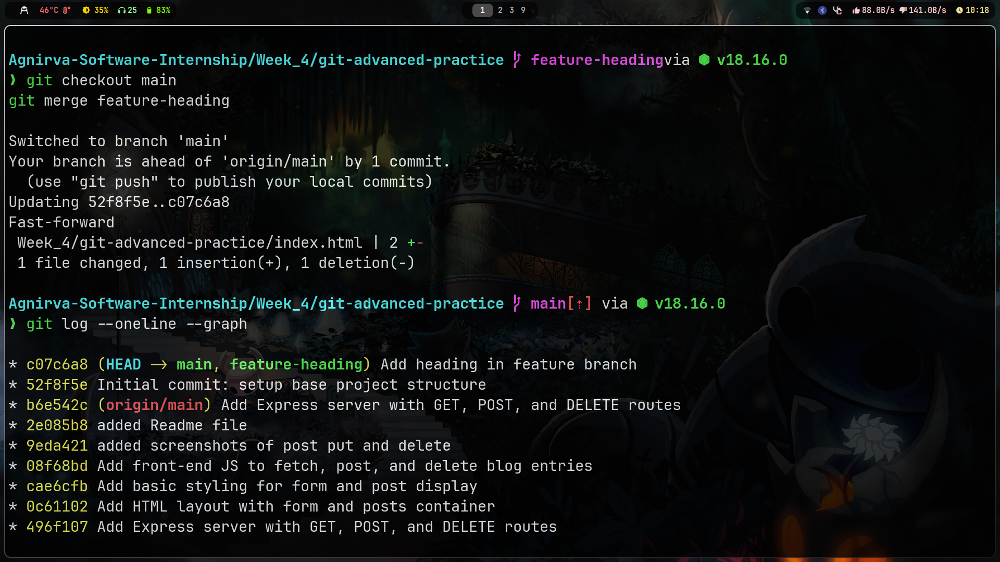
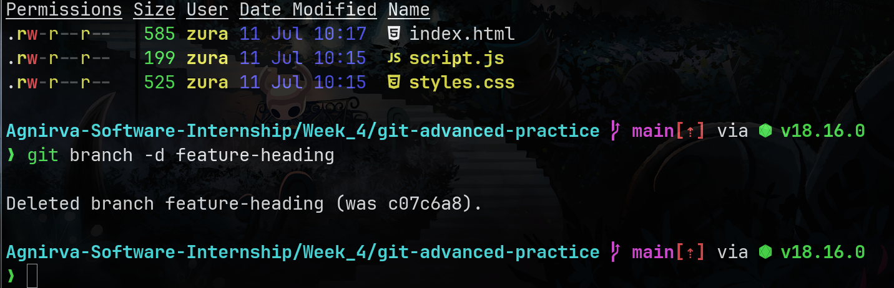
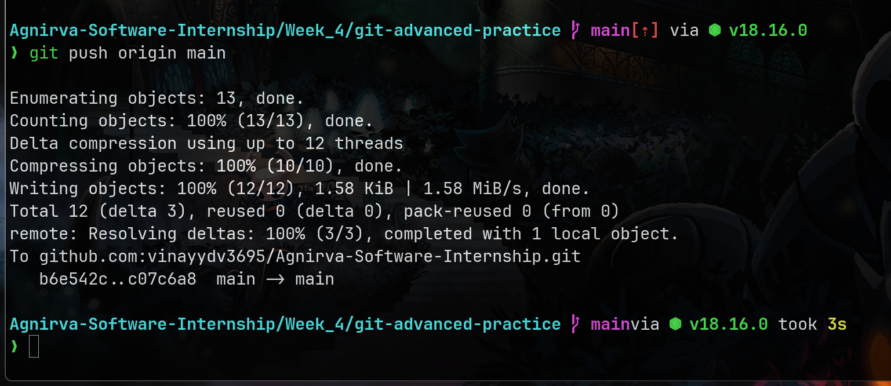
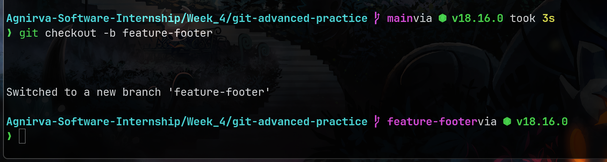
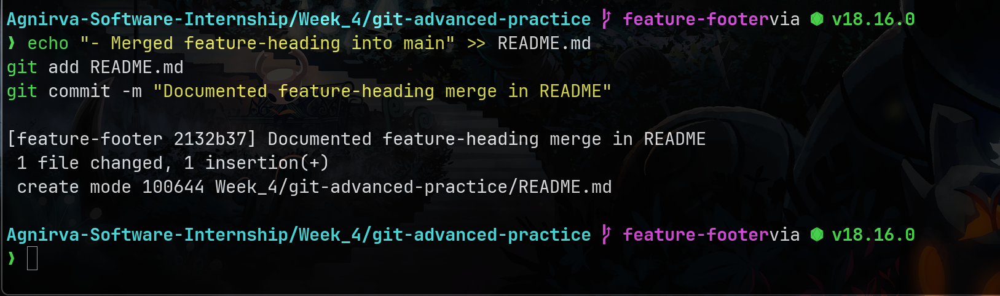

---
## Git Advanced Practice
---

## What You Practiced

- Creating and switching Git branches
- Merging feature branches into main
- Resolving merge conflicts
- Using `.gitignore`
- Simulating collaboration with multiple working directories

---

## Project Structure

```

git-advanced-practice/
├── README.md
├── assets/
│   ├── 250711\_10h18m17s\_screenshot.png  # Initialized git repo and first commit
│   ├── 250711\_10h18m42s\_screenshot.png  # Created feature branch and switched to it
│   ├── 250711\_10h20m00s\_screenshot.png  # Made and committed changes in feature branch
│   ├── 250711\_10h20m31s\_screenshot.png  # Merged feature-heading into main
│   ├── 250711\_10h21m22s\_screenshot.png  # Deleted the feature branch after merging
│   └── 250711\_10h22m44s\_screenshot.png  # Verified git log and project history
├── index.html
├── script.js
└── styles.css

```

---

## Git Command Screenshots

Here’s a step-by-step visual record of Git in action:

1. **Git Initialization & First Commit**  
   

2. **Branch Creation: `feature-heading`**  
   

3. **Changes Committed in Feature Branch**  
   

4. **Merged Feature into Main**  
   

5. **Deleted the Feature Branch**  
   

6. **Git Log Visualized**  
   

---

## Summary

This practice helps you understand how to:

- Keep your main branch stable
- Use branches for features or fixes
- Resolve merge conflicts properly
- Maintain clean Git history

---
